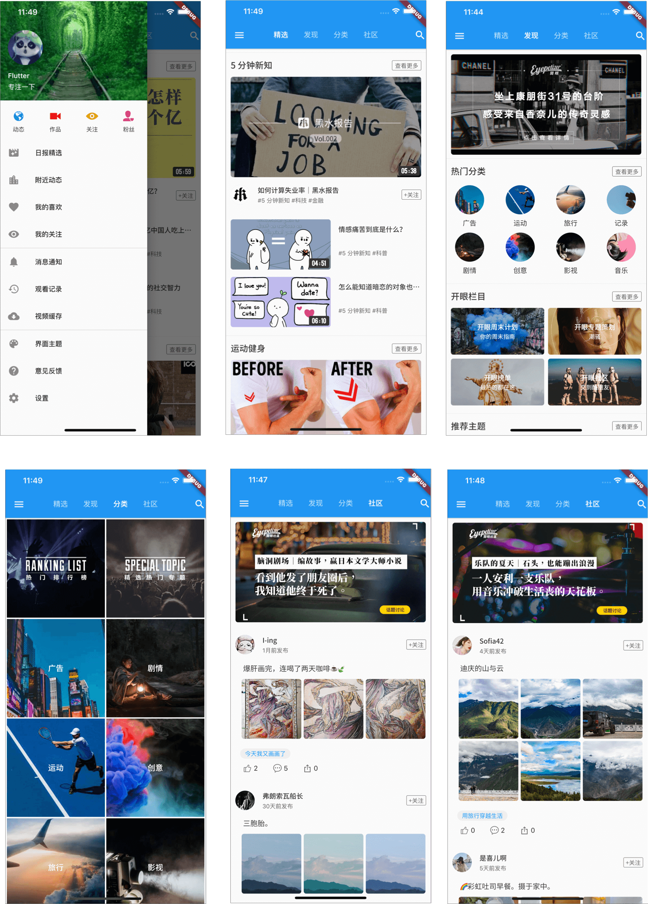

# EyeVideo

这是一款使用Flutter开发的高仿开眼视频的短视频APP

## Dart基础学习

如果你对Dart基础还不是很熟悉，欢迎参考我的 [《Dart入门实践》系列专栏](https://gitbook.cn/gitchat/column/5e8eddebf33069503095f54a)

主要涉及到的Dart知识点:

### 基础篇
* 初探 Dart 语法 01
* 初探 Dart 语法 02
* 掌握如何让函数更好地调用
* 掌握 Dart 集合的使用
* 深入分析 Dart 集合源码
* 掌握 Dart 集合操作符函数使用
* 深入分析 Dart 集合操作符源码
* 掌握 Dart 的面向对象基础
* 深入理解 Dart 中的继承和 Minxins
* 深入理解 Dart 中的类型系统和泛型
* 掌握 Dart 中库 library 的使用
* 尝鲜 Dart 2.7 最新语法之可空与非空类型
* 尝鲜 Dart 2.7 最新语法之扩展方法
* 尝鲜 Dart 2.7 最新语法之泛型强化：声明处型变
### 进阶篇
* 异步编程之 Isolate
* 异步编程之 EventLoop
* 异步编程之 Future
* 异步编程之 Stream
* 异步编程之 async和await
* 异步编程之同步异步生成器函数
### 实战篇
* Dart 与 C 的互相调用
* Dart 虚拟机运行原理
* Flutter 实现高仿开眼 APP 的页面开发 01
* Flutter 实现高仿开眼 APP 的页面开发 02
* Flutter 实现高仿开眼 APP 的页面开发 03

## 主要使用的技术点

* Dart扩展函数的使用

* Dio网络库优雅封装以及使用

* Bloc状态管理以及实现UI和逻辑分离

* json_serializable的使用

* ScreenRuler Flutter UI尺寸和字体大小的统一适配

* 列表刷新和加载更多组件实现

## 目前支持的平台有

* Android

* iOS

* Mac Desktop

* Linux Desktop

* Web Chrome

* Web Server

## 运行效果

* iOS

